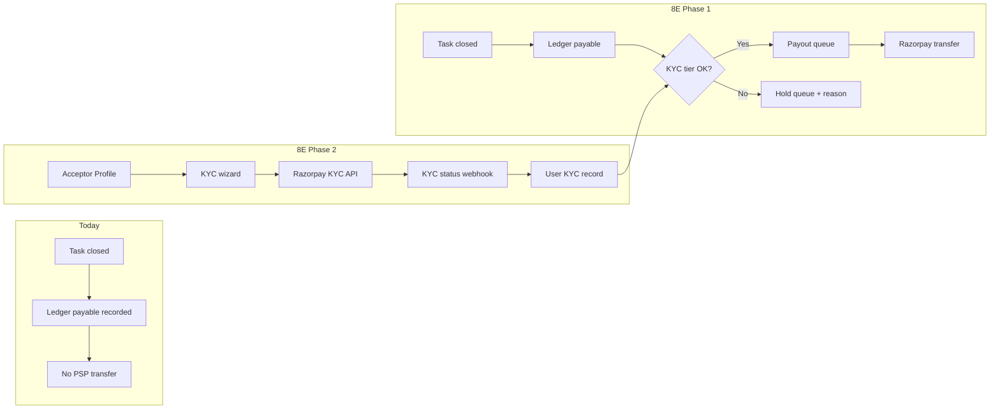
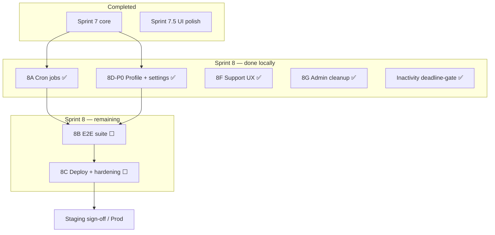

# Next POA — Production Readiness Plan

> **Purpose:** Single tracking document for everything remaining before production launch.  
> **Consolidates:** Pending profile/settings work, Sprint 7.5 UI polish status, and Sprint 8A–8E.  
> **Canonical workflow:** [`PRODUCT-WORKFLOW.md`](PRODUCT-WORKFLOW.md) · **Sprint history:** [`EXECUTION-TRACKER.md`](EXECUTION-TRACKER.md) · **Deploy & infra:** [`PRODUCTION-DEPLOYMENT-GUIDE.md`](PRODUCTION-DEPLOYMENT-GUIDE.md)  
> **Last updated:** 2026-09-24 (transaction status timeline; force-close requestor share of trust penalty)

---

## At a glance

| Metric | Value |
|--------|--------|
| **Sprints 0–7** | Complete |
| **Sprint 7.5 UI** | Admin preview scroll, close-request padding, transaction status timeline — **done** |
| **Profile & Settings review** | **8D-P0 done** — API-backed profile, server preferences, read-only admin policy |
| **Support tickets** | **8F done** — dashboard Support button, shared form, admin View Details / Mark Done |
| **Admin cancelled tasks UI** | **8G done** — nav/route removed; `GET /admin/cancelled-tasks` retained for audit |
| **Inactivity policy** | **Done** — strikes start after effective deadline in `done`; extend blocked after `done`/`disputed` |
| **Dispute cooldown** | **Done** — DSP1 immediate; 48/24/12h after later raises; resets on acceptor `done`; button stays greyed with hover remaining time |
| **DSP4 rework deadline** | **Done** — `max(deadline, review + 10 days)`; untouched when 10+ days already remain |
| **Admin Escalated filters** | **Done** — Closed DSP4 rows auto-Flagged (display-only); Flag + DSP4 Status filters independent |
| **KYC / payouts** | DR-007 locked; **detailed plan in 8E (E-KYC.1–7)** — not implemented |
| **Inactivity job** | Hourly cron; **defaults on** in local dev/staging (`NODE_ENV` ≠ production/test); runs once at API startup; strikes after **effective deadline** in `done`; `validate:inactivity` PASS |
| **Ratings (acceptor)** | **Done** — dynamic from DB (`GET /me`, `GET /users/:id/rating`, task DTOs); Profile + Task Detail + dashboard header |
| **Support form polish** | **Done** — required-field validation (all fields); public `/help-support` vs dashboard `?from=dashboard` prefill split |
| **Deploy** | `render.yaml` for API staging; frontend **not deployed** |
| **E2E** | Script-based `validate:*` exists; **no Playwright/CI suite** |
| **Production readiness** | ~80% build, ~70% launch-ready |
| **Target** | Production-ready staging + launch in **~3–4 weeks** (1 FTE) or **~2–2.5 weeks** (parallel BE/FE) |
| **Deploy guide** | [`PRODUCTION-DEPLOYMENT-GUIDE.md`](PRODUCTION-DEPLOYMENT-GUIDE.md) — domain, hosting, DB, costs, mobile, phased roadmap |

---

## Production-ready definition (exit criteria)

The app is **production-ready** when all of the following are true:

1. **Truthful UX** — No screen implies persistence that doesn’t exist (profile, admin settings).
2. **Critical paths proven** — All `PRODUCT-WORKFLOW.md` money + lifecycle paths pass automated E2E on staging.
3. **Scheduled ops** — Inactivity job runs without manual admin POST.
4. **Deployed staging** — API (Render + Neon) + static frontend with correct `VITE_API_BASE_URL`.
5. **Security baseline** — Authz abuse tests pass; webhooks signed + idempotent; admin routes protected.
6. **Observability** — Sentry + structured logs; basic runbooks for incidents, webhooks, reconciliation.
7. **Smoke on staging** — OTP → create → pay → full lifecycle works in browser against hosted API.

**Explicitly out of scope for launch (Post-MVP):** real Razorpay payouts, KYC, React Query, load tests at scale.

---

## Consolidated sprint structure

```
Sprint 8 (3–4 weeks total, can parallelize where noted)

  8A  Scheduling & jobs          (2–3 days)
  8D  Account & platform config  (4–6 days)   ── P0 before deploy
  8B  E2E critical paths         (3–5 days)
  8C  Deploy + hardening         (3–5 days)
  8F  Support ticket UX          (1–2 days)   ── can run parallel with 8D-P1
  8G  Admin cleanup              (0.5 day)    ── remove Cancelled Tasks nav
  8E  Post-MVP backlog           (ongoing)    ── KYC + real payouts
```

**Recommended order:** 8A → 8D (P0) → 8B → 8C → 8F + 8G → 8D (P1) → 8E

---

## Sprint 8A — Scheduling & jobs (2–3 days)

**Goal:** Server-side automation matches product policy without manual admin triggers.

| Step | Action | Deliverable | Exit check |
|------|--------|-------------|------------|
| 8A.1 | Add `@nestjs/schedule` cron **or** BullMQ worker for `InactivityService.processDue()` (e.g. hourly) | `JobsModule` + registered cron | Job runs in logs on schedule |
| 8A.2 | Env flag `INACTIVITY_JOB_ENABLED` (defaults **on** in dev/staging; off in production/test unless set; explicit `false` overrides) | `.env.example` + docs | Local strikes progress without manual POST |
| 8A.3 | Optional: webhook retry processor on same scheduler (if `payment_webhook_events` retry-due exists) | Shared scheduler module | Failed webhooks retry without manual script |
| 8A.4 | Extend `validate:inactivity` or add `validate:cron-registered` smoke | CI script | Passes in CI/local against running API |

**Depends on:** Sprint 7 `InactivityService` (done)  
**Blocks:** 8B inactivity path (cron must be testable via backdate + job run)

### 8A checklist

- [x] 8A.1 Cron / BullMQ registered (`ScheduledJobsService` + `@nestjs/schedule`)
- [x] 8A.2 `INACTIVITY_JOB_ENABLED` env flag (+ `WEBHOOK_RETRY_JOB_ENABLED`)
- [x] 8A.3 Webhook retry processor (every 10 min when enabled)
- [x] 8A.4 Validation smoke (`validate:jobs-cron`, `validate:inactivity` + `GET /admin/jobs/status`)

---

## Sprint 8D — Account & platform config (4–6 days)

**Goal:** Fix trust-breaking settings gaps before public staging.

### 8D-P0 — Launch blockers (3–4 days)

| Step | Action | Backend | Frontend |
|------|--------|---------|----------|
| 8D.1 | **User profile API** | `GET /me` (exists) + `PATCH /me` (name, email); optional `bio`/`location` columns or JSON `profile` field | `Profile.tsx` loads from API; remove `DEFAULT_PROFILE`; show real `createdAt` |
| 8D.2 | **Honest admin settings** | **Option A (fast):** read-only UI showing hardcoded policy constants + env. **Option B (better):** `platform_config` table + `GET/PATCH /admin/settings` | Remove fake Save toast until wired; align labels with backend (72h/144h/192h strikes, 2h quit grace, 5%/10% fees) |
| 8D.3 | **User preferences (minimal)** | `user_preferences` table or JSON on `User`: `theme`, `preferredCurrency`, notification flags | Migrate from localStorage on login; server wins on conflict |
| 8D.4 | **Profile validation** | Email format, length limits on PATCH | Inline errors; loading/error states on Profile |
| 8D.5 | **Remove dead affordances** | — | Remove avatar camera until upload exists; fix theme “system” display bug |

**8D-P0 exit:** Logged-in user sees **their** profile after refresh; admin Save either persists to DB or UI is read-only with clear copy; settings survive re-login on a new device (server-backed).

### Admin “Time & SLA” field reference

| Field | Required? | Real purpose today |
|-------|-----------|-------------------|
| **Quit grace (2h)** | Yes | Acceptor quit window → trust refund (`QUIT_GRACE_MS`) |
| **SLA warning interval** | Concept yes, this field no | Requestor inactivity on `done` → 3 strikes at **72h / 144h / 192h**, then auto-close |
| **Auto-close 3-strike** | Yes (behavior) | Always on in `InactivityService`; needs cron (8A), not a fake toggle |

### 8D-P1 — Post-staging polish (1–2 days)

| Step | Action |
|------|--------|
| 8D.6 | `PlatformConfig` drives fee/deposit/grace in `LedgerService` + `LifecycleService` (effective for new tasks) |
| 8D.7 | Notification prefs honored when email pipeline exists (gate sends on `emailNotifications`) |
| 8D.8 | Preferred role toggle (`requestor` ↔ `acceptor`) via `PATCH /me` |
| 8D.9 | Accessibility: `aria-labelledby` on switches; keyboard focus on Profile edit |

### 8D checklist

- [x] 8D.1 `PATCH /me` + Profile page API-backed
- [x] 8D.2 Admin settings honest (persist or read-only)
- [x] 8D.3 Server user preferences
- [x] 8D.4 Profile validation + loading/error states
- [x] 8D.5 Remove/fix dead UI affordances
- [ ] 8D.6 Dynamic platform config (P1)
- [ ] 8D.7 Notification prefs enforced (P1)
- [ ] 8D.8 Preferred role toggle (P1)
- [ ] 8D.9 Accessibility polish (P1)

### Profile & settings review findings (reference)

**User profile (current gaps):**
- Profile uses hardcoded `DEFAULT_PROFILE` — wrong data for non-demo users
- Edit Profile updates local state only; refresh loses changes
- Avatar camera button is non-functional
- Stats (rating, reliability, tasks) are static placeholders
- Notification toggles save to localStorage only; not enforced by backend
- Theme “system” exists in code but not in UI; misdisplayed as Light
- Currency partially used (Create Task, Dashboard only)

**Admin settings (current gaps):**
- All fields are client-side mock; Save shows toast only
- `GET/POST /admin/settings` → 404
- Platform fee 5% / trust 10% hardcoded in ledger + frontend constants
- SLA UI shows 48h; backend uses 72h/144h/192h

---

## Sprint 8B — E2E critical paths (3–5 days)

**Goal:** One automated suite proves every money/lifecycle path against `PRODUCT-WORKFLOW.md`.

**Tooling:** Playwright (browser + API helpers) **or** extend existing `validate:*` scripts into `validate:production-paths`. Prefer Playwright for CI; keep scripts as fast regression.

| Path | Steps | Existing script | New work |
|------|-------|-----------------|----------|
| **Happy path** | Create → pay reward → publish → accept + trust → comment → mark done → accept work → ledger closed | `validate:ledger-settlement`, `validate:lifecycle` | Chain into one E2E |
| **Quit path** | Accept → quit &lt;2h → trust refund → task re-open | `validate:ledger-settlement` (quit) | E2E assertion on task status |
| **Cancel path** | Create → pay → cancel → reward refund | `validate:ledger-settlement` (cancel) | Same |
| **Dispute path** | Done → dispute → DSP4 escalate → admin resolve valid/invalid | `validate:dsp4` | Browser admin step optional |
| **Force-close** | Request → admin approve → `force_closed` settlement | `validate:force-close` | Same |
| **Inactivity** | Mark done → backdate → 3 strikes → auto-close | `validate:inactivity` | Wire to cron or explicit job trigger in test |
| **Authz** | Cross-user task access denied | `validate:task-ownership` | Expand to admin route 403 for non-admin |
| **Settings** | PATCH profile → refresh → values match | — | Add after 8D-P0 |

**Deliverables:**
- `e2e/` Playwright project **or** `backend/scripts/validate-production-paths.mjs`
- CI job (GitHub Actions): API + DB, run suite on PR to `main` or nightly
- Failure artifacts (screenshots / JSON logs)

**Depends on:** 8A (inactivity), 8D-P0 (profile/settings tests)

### 8B checklist

- [ ] Happy path E2E
- [ ] Quit path E2E
- [ ] Cancel path E2E
- [ ] Dispute path E2E
- [ ] Force-close path E2E
- [ ] Inactivity path E2E
- [ ] Authz abuse tests
- [ ] Settings persistence test
- [ ] CI job wired

---

## Sprint 8C — Deploy + hardening (3–5 days)

**Goal:** Hosted staging that mirrors production; security and ops baseline.

| Step | Action | Notes |
|------|--------|-------|
| 8C.1 | Deploy API to Render (Neon DB) via `render.yaml` | Set `INACTIVITY_JOB_ENABLED=true`, `CORS_ORIGIN`, secrets — see [`PRODUCTION-DEPLOYMENT-GUIDE.md`](PRODUCTION-DEPLOYMENT-GUIDE.md) |
| 8C.2 | Deploy frontend (Render static / Vercel / Cloudflare Pages) | `VITE_API_BASE_URL` → staging API |
| 8C.3 | Staging smoke | Manual + scripted: OTP → create → mock/live payment → full lifecycle |
| 8C.4 | Authz abuse tests | Cross-user tasks, suspended user, non-admin on `/admin/*` |
| 8C.5 | Webhook replay / signature tests | Invalid signature rejected; duplicate event idempotent |
| 8C.6 | OpenAPI spec generation + typed frontend client | Partial adoption OK for launch |
| 8C.7 | Sentry (FE + BE) + `LOG_FORMAT=json` globally | Wire `VITE_SENTRY_DSN` |
| 8C.8 | Runbooks | Incident response, payout reconciliation, webhook failures (`docs/runbooks/`) |
| 8C.9 | Rate limit audit | OTP limits exist; HTTP rate limit on sensitive routes if missing |
| 8C.10 | Fix pre-existing test debt | 2× `TaskTimeline.test.tsx` dispute-cooldown failures |

**Production cutover (after staging green 48h):**
- Separate Render service or promote env vars for prod DB + Razorpay live keys
- `OTP_PROVIDER=twilio` (or prod OTP) — **not** `dev` fixed code
- DNS + HTTPS for frontend and API

### 8C checklist

- [ ] 8C.1 API deployed to Render
- [ ] 8C.2 Frontend deployed
- [ ] 8C.3 Staging smoke pass
- [ ] 8C.4 Authz abuse tests pass
- [ ] 8C.5 Webhook security tests pass
- [ ] 8C.6 OpenAPI + typed client
- [ ] 8C.7 Sentry live
- [ ] 8C.8 Runbooks committed
- [ ] 8C.9 Rate limit audit
- [ ] 8C.10 TaskTimeline test fixes
- [ ] Production cutover complete

---

## Sprint 8E — Post-MVP: KYC, payouts & growth (after launch)

> **KYC status in this doc:** Previously listed only as a one-line item (“Progressive KYC — per financial spec”). **This section is the detailed integration plan.** KYC is **not** a Sprint 8 launch blocker; it is required before **real money leaves the platform** to acceptors (PSP transfers).

### Policy source (locked)

| Reference | Content |
|-----------|---------|
| **DR-007** (`docs/sprint-0/decision-register.md`) | Tiered progressive KYC by cumulative acceptor payouts: **₹10k / ₹50k / ₹200k** |
| **Financial spec §7** (`docs/sprint-0/financial-settlement-spec.md`) | Payout only when settlement eligible + KYC tier satisfied + risk checks pass; else **payout hold queue** with reason code |
| **Current code** | Ledger records payables on close; **no PSP transfer**, **no KYC tables**, **no hold queue** |

### KYC integration approach (planned)

**Provider strategy (recommended):** Razorpay **Route / Linked Accounts** (or RazorpayX) for India acceptor onboarding — PAN + bank account verification aligned with marketplace payouts. Alternative: manual admin verification for very early beta (not production-scale).



#### 8E-KYC phases

| Phase | Scope | Backend | Frontend | Exit |
|-------|-------|---------|----------|------|
| **E-KYC.1** | Data model | `user_kyc_profiles` (tier, status, provider_ref, verified_at); `payout_holds` (user_id, amount, reason_code, task_id); link to ledger payables | — | Migration + types |
| **E-KYC.2** | Cumulative payout tracking | Sum acceptor ledger credits; compute required tier (10k/50k/200k INR per DR-007) | — | Unit tests on tier math |
| **E-KYC.3** | Payout gating | On settlement close: if acceptor below tier → create hold row instead of enqueueing transfer; reason codes: `KYC_TIER_1_REQUIRED`, etc. | — | `validate:kyc-hold` script |
| **E-KYC.4** | PSP KYC collection | Razorpay linked account create + status webhooks; store verification state | Profile → **Payout & Verification** section: status badge, “Complete verification” CTA | Sandbox KYC flow works |
| **E-KYC.5** | Payout execution | BullMQ/cron job: process payout queue → Razorpay transfer API; retry + idempotency | Transactions status page shows “Payout sent” stage | Reconciliation runbook |
| **E-KYC.6** | Admin ops | Admin panel: payout holds list, KYC tier per user, manual override (audit logged) | Admin **Payout Holds** sub-section | DR-007 “visible in admin operations panel” |
| **E-KYC.7** | Post-KYC retry | When KYC completes → release held payables → process queue | User notified in-app + email | Hold → paid E2E |

#### Tier requirements (DR-007)

| Tier | Cumulative acceptor payouts trigger | Planned verification |
|------|-------------------------------------|----------------------|
| **Tier 1** | ₹10,000 | PAN + basic identity |
| **Tier 2** | ₹50,000 | Bank account verification |
| **Tier 3** | ₹200,000 | Enhanced due diligence (address / business proof per compliance) |

#### Launch vs post-launch

| Capability | MVP launch (8C) | Requires 8E KYC |
|------------|-----------------|-----------------|
| Collect reward + trust deposits | Yes | No |
| Ledger settlement on close | Yes | No |
| Record acceptor payable in ledger | Yes | No |
| Transfer money to acceptor bank | No | **Yes** |
| Block payout when KYC incomplete | N/A until transfers | **Yes** |

**User-facing copy at launch:** Disclose that acceptor payouts are recorded in-platform and bank transfers require verification (Terms + Help).

### 8E — Other post-MVP items

| Item | Priority | Notes |
|------|----------|-------|
| PSP payout queue | High (money) | Depends on E-KYC.1–E-KYC.5 |
| Progressive KYC | High (compliance) | Detailed above (E-KYC.*) |
| Payout methods UI | High | Part of E-KYC.4 Profile section |
| React Query | Medium | Replace manual `useTasksListRefresh` polling |
| Load tests | Medium | Task list + webhook burst |
| Granular notification prefs | Medium | Per event type + email templates |
| Full `PlatformConfig` admin | Medium | Dynamic fees/SLA without deploy |
| Account deletion / data export | Medium | GDPR-style |
| Public profile / skills | Low | Marketplace growth |

### 8E checklist (KYC + payouts)

- [ ] E-KYC.1 Schema migration
- [ ] E-KYC.2 Cumulative payout tier calculation
- [ ] E-KYC.3 Payout hold gating on settlement
- [ ] E-KYC.4 Razorpay KYC / linked account + Profile UI
- [ ] E-KYC.5 Payout transfer job + idempotency
- [ ] E-KYC.6 Admin payout holds panel
- [ ] E-KYC.7 Hold release on KYC completion

---

## Sprint 8F — Support ticket UX (1–2 days)

**Goal:** Consistent support access from the User Dashboard; polished Admin Support queue. **No in-platform email thread** — admin follows up via email externally.

### Current state (already built)

| Layer | Status | Notes |
|-------|--------|-------|
| **DB** | ✅ | `SupportTicket` model with `publicId` (e.g. `RT-2026-XXXXXX`), `status`, name/email/phone/issue |
| **API** | ✅ | `POST /support/tickets` (public); `GET /admin/support/tickets`; `PATCH /admin/support/tickets/:id` |
| **Help & Support page** | ✅ | `HelpSupport.tsx` at `/help-support` — public Navbar/Footer shell; FAQ + ticket form |
| **Dashboard vs public** | ✅ | Prefill/read-only fields **only** when `?from=dashboard` + authenticated; landing `/help-support` always manual entry |
| **Admin Support page** | ✅ | Overview table, View Details dialog, Mark Done, no delete |
| **User Dashboard entry** | ✅ | Support button in `DashboardLayout` header → `/help-support?from=dashboard` |
| **User ID linkage** | ✅ | Optional JWT on `POST /support/tickets` sets `userId` |

### 8F-P0 — User Dashboard (planned)

| Step | Action | Details |
|------|--------|---------|
| 8F.1 | **Support button in header** | Add **Support** control immediately **left of** the user name/avatar in `DashboardLayout` header (desktop + mobile) |
| 8F.2 | **Route to Help & Support** | Navigate to `/help-support` (same page as public); optional query `?from=dashboard` for analytics |
| 8F.3 | **Authenticated ticket form** | When logged in: pre-fill name, email, phone from `GET /me`; hide redundant fields or show read-only |
| 8F.4 | **Consistent experience** | Option A: wrap `/help-support` in `DashboardLayout` when `from=dashboard` or authenticated. Option B: shared `<SupportTicketForm>` component used on public + dashboard shell |
| 8F.5 | **Unique ticket ID** | Already returned as `publicId` — show prominently after submit (copy button) |
| 8F.6 | **Optional API enhancement** | `POST /support/tickets` accepts JWT → set `userId` on ticket row (migration: add nullable `user_id` FK) |

### 8F-P0 — Admin Dashboard (planned)

| Step | Action | Details |
|------|--------|---------|
| 8F.7 | **Support section overview** | Table columns: **Ticket ID**, **User** (name), **Subject** (see 8F.9), **Status**, **Created Date** |
| 8F.8 | **View Details** | Row action opens dialog/drawer with full submission (name, email, phone, issue, timestamps) — no truncation |
| 8F.9 | **Subject field** | Add `subject` column to `SupportTicket` (short line, e.g. first 80 chars of issue or dedicated input); backfill from issue prefix for existing rows |
| 8F.10 | **Mark as Done** | Rename status `reviewed` → `done` (or alias both); single action like notifications “mark complete”; copy: “Seen and processed — follow up via email” |
| 8F.11 | **Remove delete** | Drop trash/delete action per product decision (audit retention); or soft-delete only |
| 8F.12 | **External email note** | Static helper text on admin page: “Reply to user email outside Reliyo.” |

### 8F timing

| When | Rationale |
|------|-----------|
| **After 8C staging deploy** (recommended) | Not a launch blocker; API exists |
| **Or parallel with 8D-P1** | Low risk UI-only if no schema change; with 8F.6/8F.9 needs small migration |

### 8F checklist

- [x] 8F.1 Support button in dashboard header
- [x] 8F.2 Link to `/help-support`
- [x] 8F.3 Pre-fill for authenticated users
- [x] 8F.4 Layout/consistency (DashboardLayout or shared form)
- [x] 8F.5 Ticket ID display + copy
- [x] 8F.6 Optional `userId` on tickets (migration)
- [x] 8F.7 Admin overview columns
- [x] 8F.8 View Details dialog
- [x] 8F.9 Subject field
- [x] 8F.10 Mark as Done status
- [x] 8F.11 Remove hard delete from UI
- [x] 8F.12 Admin email follow-up copy

---

## Sprint 8G — Admin cleanup: Cancelled Tasks (0.5 day)

**Goal:** Cancelled tasks remain **audited in the database** but are **not exposed** as a dedicated Admin Dashboard section.

### Current state

| Layer | Status |
|-------|--------|
| **DB** | ✅ `Task.cancelledAt` + cancel audit fields (Sprint 7D) |
| **API** | ✅ `GET /admin/cancelled-tasks` (internal/audit) |
| **Admin UI** | ✅ Cancelled Tasks nav/route removed; audit API retained |

### Planned changes (no data deletion)

| Step | Action |
|------|--------|
| 8G.1 | Remove **Cancelled Tasks** from `AdminLayout` sidebar navigation |
| 8G.2 | Remove route `/admin/cancelled-tasks` from `App.tsx` (or keep route unlinked for dev-only if needed) |
| 8G.3 | **Keep** `GET /admin/cancelled-tasks` API for ops/scripts/DB audit — document as internal |
| 8G.4 | Optional: filter “cancelled” in **All Tasks** admin view instead of separate page |
| 8G.5 | Update `PRODUCT-WORKFLOW.md` / admin docs: cancellation tracked in DB, not a standalone admin module |

### 8G checklist

- [x] 8G.1 Remove nav item
- [x] 8G.2 Remove or hide frontend route
- [x] 8G.3 Confirm API retained for audit
- [ ] 8G.4 Optional cancelled filter on All Tasks
- [x] 8G.5 Docs updated

---

## Sprint 8E — Post-MVP (after launch) — summary table

*Full KYC detail is in **Sprint 8E — Post-MVP: KYC, payouts & growth** above.*

| Item | Priority | Notes |
|------|----------|-------|
| PSP payout queue | High (money) | Ledger payables → Razorpay Route/transfers |
| Progressive KYC | High (compliance) | **Planned: E-KYC.1–E-KYC.7** (DR-007) |
| Payout methods UI | High | Acceptor bank/UPI in profile (E-KYC.4) |
| React Query | Medium | Replace manual `useTasksListRefresh` polling |
| Load tests | Medium | Task list + webhook burst |
| Granular notification prefs | Medium | Per event type + email templates |
| Full `PlatformConfig` admin | Medium | Dynamic fees/SLA without deploy |
| Account deletion / data export | Medium | GDPR-style |
| Public profile / skills | Low | Marketplace growth |

---

## Priority matrix (launch blockers)

| Item | Launch blocker? |
|------|-----------------|
| 8A Cron for inactivity | **Yes** |
| 8D-P0 API-backed profile (no wrong user data) | **Yes** |
| 8D-P0 Admin settings honesty (persist or read-only) | **Yes** |
| 8D-P0 Server user preferences (theme/currency/notifications) | **Yes** |
| 8B Full E2E on staging | **Yes** |
| 8C Deploy + Sentry + runbooks | **Yes** |
| 8D-P1 Dynamic platform fees from admin | No |
| 8F Support ticket UX polish | No (API exists; post-launch or week 4) |
| 8G Remove Cancelled Tasks admin nav | No |
| 8E Payouts / KYC (E-KYC.1–7) | No (required before real bank transfers) |
| React Query / load tests | No |

---

## Dependency diagram



---

## Week-by-week execution sequence

### Week 1
- **Mon–Tue:** 8A.1–8A.4 (cron + env + validation)
- **Wed–Fri:** 8D.1–8D.5 (profile API, preferences table, Profile page rewrite, admin settings honesty)

### Week 2
- **Mon–Wed:** 8B — chain existing `validate:*` scripts; add Playwright happy + cancel + quit
- **Thu–Fri:** 8B — dispute, force-close, inactivity, authz, settings tests; CI wiring

### Week 3
- **Mon–Tue:** 8C.1–8C.3 (Render API + frontend deploy, staging smoke)
- **Wed–Thu:** 8C.4–8C.8 (security tests, Sentry, runbooks, OpenAPI)
- **Fri:** Staging sign-off checklist; fix blockers

### Week 4 (buffer / prod)
- 8C prod cutover
- 8F Support header + admin View Details / Mark Done
- 8G Remove Cancelled Tasks from admin nav
- 8D-P1 if time; begin **8E E-KYC.1** schema design

---

## Timeline estimate

| Phase | Duration | Cumulative |
|-------|----------|------------|
| **8A** Scheduling | 2–3 days | ~3 days |
| **8D-P0** Profile + honest settings | 3–4 days | ~7 days |
| **8B** E2E suite | 3–5 days | ~12 days |
| **8C** Deploy + hardening | 3–5 days | **~15–17 days** |
| **8F** Support ticket UX | 1–2 days | Week 4 |
| **8G** Admin cleanup | 0.5 day | Week 4 |
| **8D-P1** Config polish | 1–2 days | Week 4 |
| **8E** KYC + payouts (E-KYC.1–7) | 2–3 weeks | Post-launch |

---

## Staging sign-off checklist

- [ ] `validate:production-paths` (or Playwright) green against **staging** API
- [ ] Inactivity cron ran at least once; `validate:inactivity` green
- [ ] Profile PATCH persists; second browser sees same data
- [ ] Admin settings not lying (saved or read-only)
- [ ] Razorpay webhook received on staging URL; signature verified
- [ ] Sentry receiving test events from FE + BE
- [ ] Runbooks committed and linked from README
- [ ] OTP not using fixed dev code in staging/prod
- [ ] CORS + `VITE_API_BASE_URL` correct for hosted frontend

---

## Completed work (do not rework)

| Item | Status |
|------|--------|
| Sprints 0–7 (core marketplace) | Done |
| Sprint 7 Phase 1 localStorage cleanup | Done |
| Admin task preview scroll (`AdminTaskDetailDialog`) | Done |
| Close Requests review dialog padding | Done |
| User transaction status timeline (`/transactions/status/:taskId`) | Done |
| `validate:inactivity`, `validate:dsp4`, `validate:force-close`, etc. | Done |
| Support tickets API + DB (`SupportTicket.publicId`) | Done |
| Admin Support page (View Details, Mark Done) | Done (8F) |
| Dashboard Support entry + authenticated tickets | Done (8F) |
| Admin Cancelled Tasks UI removed | Done (8G) |
| Deadline-gated inactivity (8A + policy fix) | Done — anchor = max(statusEnteredAt, deadline); UI review period |

---

## Changelog

| Date | Update |
|------|--------|
| 2026-06-23 | Created `NEXT-POA.md` — consolidated profile/settings review + Sprint 8A–8E production plan |
| 2026-06-23 | Added **8E KYC integration plan** (E-KYC.1–7, DR-007), **8F Support ticket UX**, **8G Cancelled Tasks admin removal** |
| 2026-06-23 | Added [`PRODUCTION-DEPLOYMENT-GUIDE.md`](PRODUCTION-DEPLOYMENT-GUIDE.md) — infra, costs, compliance, phased launch roadmap |
| 2026-07-07 | **Sprint 8D-P0 complete** — `PATCH /me`, server preferences, read-only admin settings, `validate:profile-settings` |
| 2026-07-07 | **Sprint 8F + 8G complete** — dashboard Support, admin ticket queue polish, cancelled tasks nav removed, `validate:support-tickets` |
| 2026-08-11 | **Sprint 8A complete** — hourly inactivity + webhook retry cron, `INACTIVITY_JOB_ENABLED`, `validate:jobs-cron` |
| 2026-08-11 | **Inactivity deadline-gating** — strikes only after effective deadline in `done`; extend blocked after `done`/`disputed`; review-period UI + force-close policy note; extended `validate:inactivity` |
| 2026-08-20 | **Inactivity job dev fix** — `INACTIVITY_JOB_ENABLED` defaults on outside production/test; startup `processDue` run; UI shows “strike due — pending check” instead of stuck “in 1 minute”; `validate:inactivity` re-verified |
| 2026-08-20 | **Support polish** — all ticket fields required with inline validation; subject required on API; public help-support decoupled from dashboard shell |
| 2026-08-20 | **Ratings** — dynamic acceptor ratings across Profile, Task Detail, Browse; `GET /users/:id/rating`; refresh on task close |
| 2026-09-10 | **Dispute cooldown** — DSP1 immediate; 48h → 24h → 12h after later raises; cooldown resets when acceptor marks `done` again; Raise Dispute stays visible and greyed with remaining time on hover; `cooldowns.disputeAfter` persists across refresh/re-login |
| 2026-09-10 | **DSP4 rework deadline** — do not modify when 10+ days remain from review; otherwise set to 10 days from review date (passed deadline, or remaining < 10 days). `extendedDeadline` written only when the date moves |
| 2026-09-24 | **Transaction status** — View Status follows reward deposit, trust deposit, quit refund, delete/force-close refund, and close payout. "No Further Settlements" only after `deleted` / `closed` / `force_closed` settlement is recorded. Force-close requestor credit is full reward + 70% of the 3% trust penalty |
