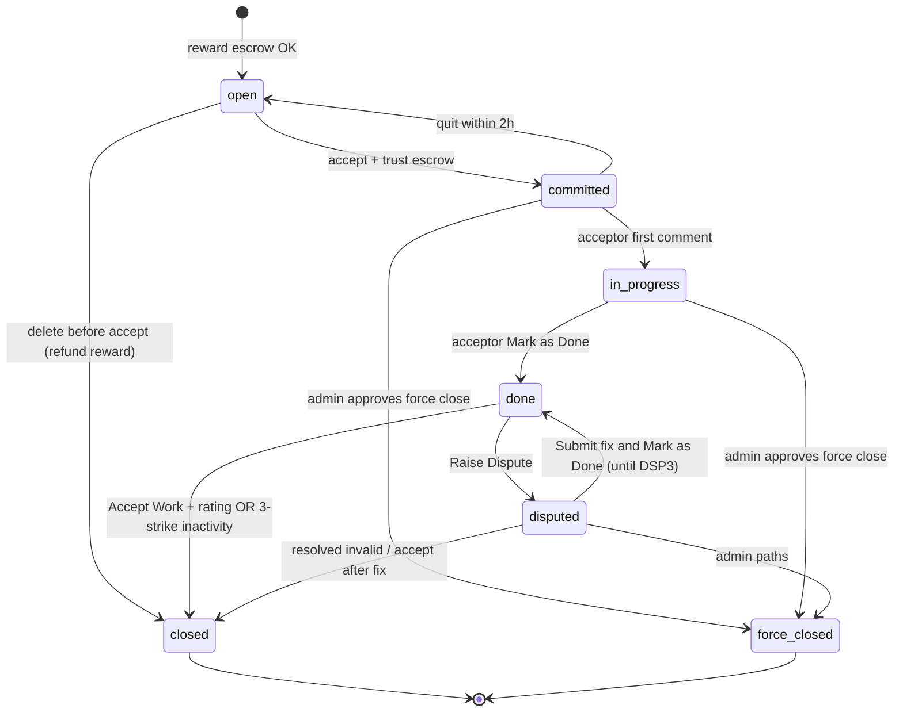

# Reliyo — Product workflow (canonical)

**Version:** 1.0  
**Status:** **SOURCE OF TRUTH** for product behavior, task lifecycle, and admin operations  
**Last reviewed against codebase:** 2026-05-25 (Sprints 0–4 core + fund-hold payments)

> **Before implementing any feature:** complete the [Pre-implementation validation](#pre-implementation-validation) checklist against this document and [`docs/sprint-0/`](sprint-0/) policy specs.  
> **Enforced in Cursor:** [`.cursor/rules/product-workflow-validation.mdc`](../.cursor/rules/product-workflow-validation.mdc) (`alwaysApply: true`).  
> **Sprint execution status:** [`docs/EXECUTION-TRACKER.md`](EXECUTION-TRACKER.md)

---

## Table of contents

1. [Authority & related docs](#authority--related-docs)
2. [Pre-implementation validation](#pre-implementation-validation)
3. [Platform overview](#platform-overview)
4. [Authentication & roles](#authentication--roles)
5. [Requestor / acceptor UI](#requestor--acceptor-ui)
6. [Create task flow](#create-task-flow)
7. [Managing created tasks](#managing-created-tasks)
8. [Task acceptance flow](#task-acceptance-flow)
9. [Task status contract](#task-status-contract-do-not-deviate)
10. [Status rules (who can act)](#status-rules-who-can-act)
11. [Financial rules](#financial-rules)
12. [Disputes & DSP4](#disputes--dsp4)
13. [Deadline rules](#deadline-rules)
14. [Admin dashboard](#admin-dashboard)
15. [Implementation alignment (as of Sprint 4)](#implementation-alignment-as-of-sprint-4)
16. [Known deviations & technical debt](#known-deviations--technical-debt)
17. [Recommended sprint priorities](#recommended-sprint-priorities)

---

## Authority & related docs

| Document | Role |
|----------|------|
| **This file** | End-to-end product workflow (user-facing + lifecycle) |
| [`docs/sprint-0/state-machine-spec.md`](sprint-0/state-machine-spec.md) | Backend transition contract (locked) |
| [`docs/sprint-0/financial-settlement-spec.md`](sprint-0/financial-settlement-spec.md) | Escrow, fees, settlement math |
| [`docs/sprint-0/dispute-ops-spec.md`](sprint-0/dispute-ops-spec.md) | DSP1–DSP4 admin matrix |
| [`docs/EXECUTION-TRACKER.md`](EXECUTION-TRACKER.md) | What is built vs planned |

If this document and Sprint 0 specs disagree on **status names, transitions, or cooldowns**, **Sprint 0 wins** until this file is explicitly revised and signed off.

---

## Pre-implementation validation

Use this checklist for every PR / feature:

- [ ] **Rule Zero:** No task enters `open` without confirmed reward escrow.
- [ ] **Status set:** Only the seven valid statuses are used (no `draft`, `completed`, etc.).
- [ ] **Transitions:** Change matches the [status contract](#task-status-contract-do-not-deviate) and Sprint 0 spec.
- [ ] **Cooldowns:** Quit (2h), Raise Dispute (48h), Request Force Close (24h) enforced **server-side**.
- [ ] **Roles:** Authorization uses server-derived task context (requestor / acceptor / admin), not client input.
- [ ] **Self-accept:** Requestor cannot accept own task.
- [ ] **One acceptor:** At most one acceptor per task.
- [ ] **Trust deposit:** Accept moves to `committed` only after 10% trust hold is confirmed.
- [ ] **Money:** Status commits that imply settlement have ledger entries (Sprint 6+) or are explicitly marked UI-only.
- [ ] **Timeline:** Every transition appends an auditable event.
- [ ] **Admin:** Force-close and DSP4 paths require admin role and audit trail.

---

## Platform overview

### Main dashboard (landing)

- Entry: **Log in** (existing account) or **Get Started / Start Now** (new account).
- Footer:
  - **Resources:** Help & Support
  - **Company:** About Us, Leadership, Contact Us
  - **Follow Us:** LinkedIn, YouTube, Instagram
  - Copyright, Terms of Service, Privacy Policy

### Role model

- Users are **not** permanently tagged as requestor or acceptor.
- The same user may create tasks, accept tasks, or both.
- **Platform admin** is a separate `platform_role` (not a marketplace role).

---

## Authentication & roles

### Sign-in / sign-up

- Phone OTP (no fixed password per role).
- **Dev / demo phones** (seeded): `9000000001` (requestor bias), `9000000002` (acceptor bias), `9000000003` (admin).

### Implementation note

- DB stores optional `preferred_role` for onboarding UX only; it does **not** restrict actions.

---

## Requestor / acceptor UI

After login, navigation includes:

| Area | Purpose |
|------|---------|
| **Create Task** | Post new work |
| **Dashboard** | Stats: tasks, earnings |
| **My Tasks** | Tabs: **Created**, **Accepted**, **In Dispute** |
| **Browse Tasks** | Discover open tasks (filters: country, domain) |
| **Notifications** | System + task alerts; mark read / flag |
| **Profile** | Basic profile settings |

---

## Create task flow

### Fields

| Field | Notes |
|-------|--------|
| Title | |
| Description | |
| Work Type | Virtual, Physical, Hybrid |
| Manpower | Integer |
| Required Skills | |
| Update Frequency | Daily, Weekly, **Biweekly**, Monthly |
| Domain | Tech, Design, Marketing, Writing, Translation, Delivery, Cleaning, Other |
| Country | Drives currency |
| State, City | |
| Reward | Currency from country |
| Deadline | Date picker |

### Steps

1. Enter details → **Next**
2. **Review Your Task** → **Next** → lock reward (terms)
3. Accept terms → **Confirm & Publish**
4. **Payment** (UPI, card, net banking) → on success, task is **published**

### Rule Zero

> A task exists **only after reward escrow succeeds**. There is **no draft status**.

First status after publish: **`open`**.

---

## Managing created tasks

From **My Tasks → Created**, opening a task shows:

- Task details
- Task lifecycle / timeline
- Payment breakdown
- **Activity & Comments** (after acceptance)

### Requestor actions (open only)

- **Delete task** before any acceptor commits:
  - Task removed from lists and browse
  - **Full reward** refunded to requestor

### Constraints

- Requestor **cannot** accept own task.

---

## Task acceptance flow

1. Another user browses and opens task details.
2. **Accept Task** → lock **trust deposit = 10% of reward** → accept terms → confirm.
3. **Payment** → on success → status **`committed`**; task under **My Tasks → Accepted**.

### Quit (committed only)

- Allowed within **2 hours** of acceptance.
- Trust deposit **fully refunded**; task returns to **`open`** in browse.
- After 2 hours: quit disabled (“Quit Expired”).

---

## Task status contract (DO NOT DEVIATE)

### Valid statuses

`open` · `committed` · `in_progress` · `done` · `disputed` · `closed` · `force_closed`

### Cooldowns (UI + server)

| Action | Cooldown |
|--------|----------|
| Quit Task | 2 hours from acceptance |
| Raise Dispute | 48 hours from last dispute raise |
| Request Force Close | 24 hours from last force-close request |

### Transition diagram (allowed edges)

---

## Status rules (who can act)

### 1. OPEN

**Meaning:** Reward in escrow; task live; awaiting acceptor.

| Actor | Actions |
|-------|---------|
| Acceptor (not requestor) | Accept → `committed` (after trust payment) |
| Requestor | Delete before accept → refund reward, remove task |

---

### 2. COMMITTED

**Meaning:** Acceptor locked trust deposit; work not started.

| Actor | Actions |
|-------|---------|
| Acceptor | First comment → `in_progress` (work start signal) |
| Acceptor | Quit within 2h → trust refunded, `open` |
| Requestor | **Send Alert** (system timeline message) |
| Requestor | **Request Force Close** → admin queue; stays `committed` until admin acts |

---

### 3. IN PROGRESS

**Meaning:** Acceptor started work (first comment after commit).

| Actor | Actions |
|-------|---------|
| Acceptor | Comments; **Mark as Done** → `done` |
| Requestor | Comments; Send Alert; Request Force Close (admin approval → `force_closed`) |

---

### 4. DONE

**Meaning:** Acceptor marked work complete; awaiting requestor.

| Actor | Actions |
|-------|---------|
| Acceptor | Comments only |
| Requestor | Comments; **Accept Work** (mandatory rating) → `closed` + settlement |
| Requestor | **Raise Dispute** → `disputed` (DSP counter increments) |

#### 3-strike requestor inactivity (deadlock prevention)

| Strike | Trigger after requestor inactivity |
|--------|----------------------------------|
| 1 | 3 days in `done` |
| 2 | +3 days |
| 3 | +2 days → auto **`closed`** + escrow release per settlement rules |

> Applies to **requestor** inactivity in `done` only—not acceptor inactivity.

---

### 5. DISPUTED

**Meaning:** Formal disagreement; fix/resolution cycle.

| Actor | Actions |
|-------|---------|
| Requestor | Comments; raise another dispute after 48h cooldown (up to 4 total) |
| Acceptor | Comments; **Submit fix and Mark as Done** → `done` (allowed until **3rd** dispute / DSP3) |
| Admin | DSP4 only: review timeline; set DSP4 status → drives task status (see below) |

#### Dispute levels

- **DSP1–DSP3:** Requestor ↔ acceptor; acceptor may return task to `done`.
- **DSP4 (4th dispute):** Escalated to admin; acceptor **cannot** change status; admin only.

#### DSP4 status → task status (admin)

| Admin DSP4 status | Resulting task status (users see) |
|-------------------|-----------------------------------|
| OPEN | `disputed` (DSP4) |
| RESOLVED VALID | `disputed` (DSP4) **or** `force_closed` |
| RESOLVED INVALID | `closed` |
| ADMIN CLOSED | `force_closed` |

---

### 6. CLOSED

**Meaning:** Successful completion.

**System settlement:**

- Pay acceptor: **reward − 5% platform fee**
- Refund acceptor: **full trust deposit**

**Entry paths:** Requestor Accept Work; 3-strike auto-close from `done`.

---

### 7. FORCE CLOSED

**Meaning:** Admin-approved requestor force-close, or DSP4 ADMIN CLOSED.

**System settlement:**

- Refund requestor: **full reward**
- Acceptor compensation from trust: **trust deposit − 3% platform fee** (remainder to acceptor per policy)

---

## Financial rules

| Event | Platform fee | Notes |
|-------|----------------|-------|
| Normal close (`closed`) | 5% of **reward** on payout to acceptor | Trust deposit fully refunded |
| Force close (`force_closed`) | 3% of **trust deposit** | Reward refunded to requestor |
| Delete open task | None on reward | Full reward refund |
| Quit within 2h | None | Full trust refund |

All amounts are **platform-held** until settlement (Sprint 6 ledger).

---

## Disputes & DSP4

- Requestor may raise up to **4** disputes per task.
- Cooldown **48h** between raises.
- After DSP4 escalation, only **admin** may resolve status via DSP4 matrix above.
- **Resolved Valid** rework window (acceptor):
  - If deadline **passed:** +10 days minimum working window; else force close.
  - If deadline **not passed:** window = time to deadline; if &lt; 10 days remain, extend to **10 days** minimum after deadline.

---

## Deadline rules

- Requestor may **extend deadline** from Activity & Comments (new deadline replaces old).
- Acceptor notified before deadline; failure may lead to requestor extension loop.
- Post–DSP4 Resolved Valid: see [Disputes & DSP4](#disputes--dsp4).

---

## Admin dashboard

| Section | Capability |
|---------|------------|
| **Dashboard** | Platform stats |
| **All Tasks** | All statuses; view details |
| **Users** | List; **suspend** for ToS violations |
| **Disputes** | DSP1–DSP3 view-only |
| **Escalated** | DSP4; admin can update status |
| **Close Requests** | Approve/reject requestor force-close |
| **Revenue** | Platform revenue stats |
| **Analytics** | Task distribution / performance |
| **Notifications** | View, mark read, flag |
| **Support** | Tickets; accept/delete; email follow-up |
| **Settings** | Platform configuration |

### List parameters (reference)

- **All Tasks:** Task ID, Title, Requestor, Acceptor, Status, Reward, Created
- **Users:** User, Tasks Created, Tasks Accepted, Onboarded On, Inactivity Tracker, Status
- **Disputes / Escalated:** Dispute ID, Task, Requestor, Acceptor, Level, Raised, Status (+ DSP4 Status for escalated)
- **Close Requests:** Task ID, Title, Requestor, Acceptor, Task Status, Requested
- **Support:** Ticket ID, Name, Email, Phone, Issue, Date, Status, Actions

---

## Implementation alignment (as of Sprint 4)

Legend: ✅ Aligned · 🟡 Partial · ⬜ Not implemented · ⚠️ Deviation

### Platform & auth

| Workflow item | Status | Notes |
|---------------|--------|-------|
| Landing + footer links | ✅ | `Index.tsx`, `Footer.tsx` |
| OTP login/signup | ✅ | Nest `AuthModule`, `AuthContext` |
| No permanent marketplace role | 🟡 | `preferred_role` is UX-only; aligns with intent |
| Demo phones 9000000001–3 | ✅ | `prisma/seed.ts` |

### Requestor / acceptor UI

| Workflow item | Status | Notes |
|---------------|--------|-------|
| Create Task (all fields + review) | ✅ | `CreateTask.tsx` |
| Update frequency “Biweekly” | ⚠️ | UI label **Bi-weekly** (`CreateTask.tsx`) |
| Payment before publish | 🟡 | Fund holds + mock gateway (`/payment`) |
| Dashboard stats | ⬜ | `Dashboard.tsx` uses **localStorage** |
| My Tasks (Created / Accepted / Dispute) | 🟡 | API `scope=mine`; dispute tab may be incomplete |
| Browse Tasks (country, domain) | 🟡 | API `scope=browse`; filters partial |
| Notifications (read/flag) | ⬜ | Client `lib/notifications.ts`; no backend module |
| Profile | 🟡 | UI exists; partial API tie-in |

### Task lifecycle (backend)

| Workflow item | Status | Notes |
|---------------|--------|-------|
| Rule Zero (reward before `open`) | ✅ | `fund_holds` + `fundHoldId` on create |
| Trust 10% on accept | ✅ | `trust_deposit` hold + `accept` API |
| Status enum (7 values) | ✅ | Prisma `TaskStatus` |
| Transitions + cooldowns | ✅ | `lifecycle.service.ts`, `lifecycle.types.ts` |
| `availableActions` API | ✅ | Returned on task detail |
| accept / quit / mark-done / accept-work / dispute | ✅ | `tasks.service.ts` |
| First comment → `in_progress` | ✅ | `addComment` when `committed` |
| extend deadline | ✅ | `POST .../extend-deadline` |
| Send Alert | ⬜ | No dedicated API; UI/local only |
| Request Force Close | ⬜ | Timeline UI only; no admin workflow API |
| 3-strike inactivity | ⬜ | Client `lib/inactivity.ts` only |
| Delete open task (remove + refund) | ⚠️ | `DELETE` sets `cancelledAt`, transitions to **`closed`**, not hard delete; **no ledger refund** |

### Task lifecycle (frontend)

| Workflow item | Status | Notes |
|---------------|--------|-------|
| Create → payment → API create | ✅ | Wired |
| Accept → payment → API accept | ✅ | Wired |
| Task detail load | 🟡 | API + localStorage fallback |
| Timeline mutations | ⚠️ | `TaskTimeline.tsx` mostly **localStorage**; only some API use in `TaskDetail` |
| Cancel / delete | 🟡 | API `cancelTask` available; timeline actions often local |

### Financial

| Workflow item | Status | Notes |
|---------------|--------|-------|
| UPI / card / net banking UI | 🟡 | Mock outcomes in `payment-outcomes.ts` |
| 5% / 3% settlement | ⬜ | Spec only; `ledger` module stub |
| Escrow release on close / force close | ⬜ | Sprint 6 |

### Disputes & admin

| Workflow item | Status | Notes |
|---------------|--------|-------|
| DSP1–3 counter + cooldown | 🟡 | Backend `dispute` API; UI/local dispute IDs |
| DSP4 admin matrix | ⬜ | `disputes` module stub; admin pages use `adminData` / localStorage |
| Admin All Tasks | 🟡 | API `scope=admin` |
| Admin Users suspend | 🟡 | API exists; `AdminUsers.tsx` not fully wired |
| Close Requests approve/reject | ⬜ | Local toasts only |
| Revenue / Analytics / Support | ⬜ | Demo/local data |

---

## Known deviations & technical debt

| ID | Deviation | Target fix |
|----|-----------|------------|
| D1 | TaskTimeline drives status via localStorage | Wire all actions to task APIs; refetch detail |
| D2 | Cancel uses status `closed` + `cancelledAt` vs “removed” open task | Align with Sprint 0 “cancelled” archival + ledger refund (Sprint 6) |
| D3 | `open` → `closed` allowed in `VALID_TRANSITIONS` for cancel | Document as cancel path; consider distinct settlement type |
| D4 | 3-strike inactivity client-only | BullMQ/cron job + server transition (Sprint 7+) |
| D5 | Force-close request + admin approval | Admin APIs + Close Requests UI (Sprint 7) |
| D6 | Notifications not persisted | Notifications service + DB (Sprint 7+) |
| D7 | “Bi-weekly” vs “Biweekly” label | Normalize in API validation + UI |
| D8 | Social links placeholder `#` | Content/marketing |
| D9 | EXECUTION-TRACKER Sprint 5 “Rule Zero ⬜” | Update: fund holds satisfy Rule Zero pre-gateway |

---

## Recommended sprint priorities

Aligned with [`EXECUTION-TRACKER.md`](EXECUTION-TRACKER.md):

| Sprint | Workflow coverage |
|--------|-------------------|
| **4 polish** | Wire `TaskTimeline` → API; Dashboard/My Tasks fully API; remove demo timeline dependency |
| **5** | Real PSP + webhooks; replace mock fund-hold confirmation |
| **6** | Ledger settlements for close, force close, cancel, quit |
| **7** | DSP4 admin, force-close requests, notifications, support tickets, user suspend UI |
| **8** | E2E against this document; staging deploy |

### Highest-impact next steps

1. **TaskTimeline API cutover** — single source of truth for status (fixes D1).
2. **Server 3-strike job** — prevents client manipulation (D4).
3. **Admin force-close + DSP4 APIs** — unblock escrow edge cases (D5).
4. **Ledger on terminal states** — money matches workflow (Sprint 6).

---

## API quick reference (implemented)

| Method | Path | Workflow action |
|--------|------|-----------------|
| POST | `/payments/fund-holds` | Lock reward or trust |
| POST | `/payments/fund-holds/:id/confirm` | Confirm hold (mock) |
| POST | `/tasks` | Publish (`open`) after reward hold |
| GET | `/tasks?scope=mine\|browse\|admin` | Lists |
| GET | `/tasks/:id` | Detail + timeline + `availableActions` |
| DELETE | `/tasks/:id` | Cancel open task (requestor) |
| POST | `/tasks/:id/accept` | Accept + trust hold |
| POST | `/tasks/:id/quit` | Quit within 2h |
| POST | `/tasks/:id/comments` | Comment; may → `in_progress` |
| POST | `/tasks/:id/mark-done` | → `done` |
| POST | `/tasks/:id/accept-work` | Rating + → `closed` |
| POST | `/tasks/:id/dispute` | → `disputed` |
| POST | `/tasks/:id/extend-deadline` | Extend deadline |
| PATCH | `/admin/users/:id/suspension` | Suspend user |

---

*Maintainers: update §15–§16 when shipping lifecycle, payment, or admin changes.*
