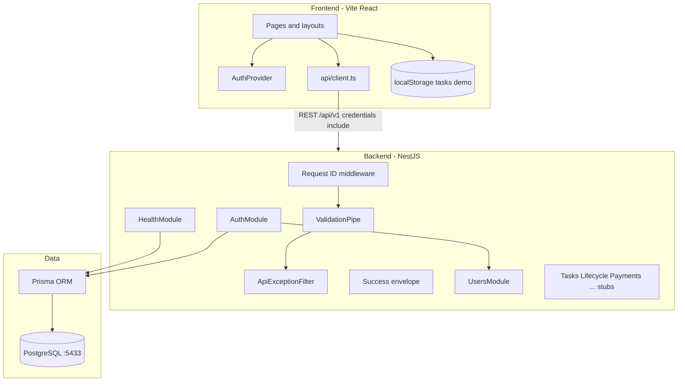

# Reliyo — Project overview (Sprints 0–3)

Technical reference for engineers, PMs, and stakeholders.

| Doc | Purpose |
|-----|---------|
| **[`PRODUCT-WORKFLOW.md`](PRODUCT-WORKFLOW.md)** | **Canonical product workflow** — lifecycle, UI flows, gap matrix; validate changes here first |
| **[`EXECUTION-TRACKER.md`](EXECUTION-TRACKER.md)** | Sprint progress and task checkboxes |
| **[`sprint-0/`](sprint-0/)** | Locked policy specs (state machine, settlement, disputes) |

---

## 1. What this system is

**Reliyo** is a task marketplace: requestors post work with funded rewards; acceptors commit with trust deposits; the platform holds funds until lifecycle rules allow settlement. The MVP is built as a **modular monolith** (NestJS API + React SPA) with policy locked in Sprint 0 and implementation through 8 sprints.

| Concern | Current state (post–Sprint 3) |
|---------|-------------------------------|
| Business rules | Locked in `docs/sprint-0/` |
| User identity | **Server-authoritative** (OTP + JWT) |
| Task lifecycle | **Client-side demo** (`localStorage`) — Sprint 4 target |
| Money movement | UI simulation only — Sprints 5–6 |
| Production deploy | Not yet — Sprint 8 |

---

## 2. Architecture (high level)



### Request flow (authenticated)

1. Browser calls `POST /auth/otp/verify` → receives **access JWT** (memory) + **refresh cookie** (httpOnly).
2. Subsequent calls send `Authorization: Bearer` + cookies on `credentials: include`.
3. `POST /auth/refresh` rotates refresh session in DB.
4. `GET /me` returns user profile (`JwtAuthGuard`).

### Authority model (target)

| Data | Authority today | Target |
|------|-----------------|--------|
| User / session | API + DB | ✅ |
| Task status | `localStorage` | API + DB (Sprint 4) |
| Payments | UI mock | Webhooks + DB (Sprint 5) |
| Balances / settlement | None | Ledger (Sprint 6) |

---

## 3. Repository layout

```
reliyo-full/
├── src/                    # React frontend (reliyo-frontend)
│   ├── pages/              # Routes: marketing, dashboard, admin
│   ├── components/         # UI + layouts
│   ├── contexts/           # AuthProvider (Sprint 3)
│   └── lib/
│       ├── api/            # HTTP client + contracts
│       ├── auth/           # Session, API, types
│       ├── taskTypes.ts    # Canonical lifecycle types
│       └── adminData.ts    # Admin reads localStorage (temporary)
├── backend/                # NestJS API (reliyo-api)
│   ├── prisma/             # Schema + migrations + seed
│   └── src/
│       ├── auth/           # OTP, JWT, guards, controllers
│       ├── users/          # User service + mapper
│       ├── health/         # Health checks
│       ├── common/         # Filters, middleware, crypto, logging
│       └── [tasks|lifecycle|payments|...]/  # Empty modules (Sprint 4+)
├── docs/
│   ├── sprint-0/           # Locked policy specs
│   ├── sprint-1..3/        # Sprint notes
│   ├── EXECUTION-TRACKER.md
│   └── PROJECT-OVERVIEW.md # This file
├── docker-compose.yml      # Postgres (host 5433)
└── .github/workflows/      # backend-ci, frontend-ci
```

---

## 4. Key files (by area)

### Frontend

| File | Purpose |
|------|---------|
| `src/main.tsx` | Bootstrap, theme, error boundary |
| `src/App.tsx` | Routes, `QueryClientProvider`, `AuthProvider` |
| `src/contexts/AuthContext.tsx` | Session bootstrap via `/auth/refresh`, sign-out |
| `src/lib/api/client.ts` | Fetch wrapper, error envelope, Bearer + cookies |
| `src/lib/auth/api.ts` | Auth endpoints |
| `src/lib/auth/session.ts` | In-memory access token only |
| `src/lib/taskTypes.ts` | Canonical `TaskStatus` enum |
| `src/lib/taskMigration.ts` | Legacy `completed` → spec statuses |
| `src/lib/adminData.ts` | Admin aggregates from `localStorage` |
| `src/pages/SignIn.tsx`, `VerifyOtp.tsx`, `SignUp.tsx` | Auth UX wired to API |

### Backend

| File | Purpose |
|------|---------|
| `src/main.ts` | Nest bootstrap, CORS, cookie-parser, global prefix |
| `src/app.module.ts` | Module graph |
| `src/common/filters/api-exception.filter.ts` | Sprint 0 error shape |
| `src/common/interceptors/success-envelope.interceptor.ts` | `{ data, requestId }` |
| `src/common/middleware/request-id.middleware.ts` | `x-request-id` |
| `src/auth/auth.service.ts` | OTP verify → user + tokens |
| `src/auth/otp.service.ts` | OTP issue/verify, rate limits |
| `src/auth/token.service.ts` | JWT + refresh rotation |
| `src/auth/auth.controller.ts` | `/auth/*` + `MeController` |
| `src/auth/guards/*.ts` | JWT, roles, suspension, task stub |
| `prisma/schema.prisma` | User, OTP, refresh, audit_events |
| `prisma/seed.ts` | Demo users 9000000001–3 |

### Infrastructure

| File | Purpose |
|------|---------|
| `docker-compose.yml` | Postgres 16, port **5433:5432** |
| `backend/.env.example` | All backend env vars documented |
| `.github/workflows/backend-ci.yml` | Lint, test, build on `backend/**` |
| `.github/workflows/frontend-ci.yml` | Lint, test, build on frontend |

---

## 5. Major technical decisions

| Decision | Choice | Rationale |
|----------|--------|-----------|
| API style | REST `/api/v1` | Simple SPA integration; versioned prefix |
| Errors | `{ error: { code, message, requestId } }` | Sprint 0 contract |
| Auth | Phone OTP + JWT access + opaque refresh | Mobile-first; rotation in DB |
| Refresh storage | httpOnly cookie + hashed DB row | XSS-resistant vs localStorage |
| Access storage | Memory only on client | Short-lived; not in localStorage |
| ORM | Prisma on PostgreSQL | Team velocity; migrations in repo |
| Local Postgres port | **5433** on host | Avoids conflict with Windows local PG on 5432 |
| Monolith | Nest modules per domain | Split services only when needed |
| Queues | Deferred (BullMQ) | Introduce with first webhook/settlement job |
| Task data (interim) | `localStorage` | Sprint 1 demo until Sprint 4 cutover |

---

## 6. Changes by sprint (implementation)

### Sprint 0 — Policy lock (docs only)

- Decision register DR-001–DR-008 locked.
- Specs: state machine, settlement, disputes, API errors.
- No application code.

### Sprint 1 — Frontend hardening

- Removed legacy `completed` status; migration helper.
- API client aligned to error contract + trace header.
- Copy: “platform-held funds”.
- `reliyo-frontend` package naming; observability hooks.

### Sprint 2 — Backend foundation

- Nest app: validation, envelopes, request IDs, health.
- Prisma + `audit_events` migration.
- Docker Compose; backend CI.
- Later completed: domain module shells, frontend CI, logging helper.

### Sprint 3 — Authentication

- Models: `users`, `otp_challenges`, `refresh_sessions`.
- Endpoints: OTP send/verify, refresh, logout, `/me`.
- Guards scaffolded; JWT on `/me`.
- Frontend: `AuthProvider`, real sign-in/sign-up/verify.
- Fixes: `cookie-parser` require, CSS `@import` order, DB port 5433.

---

## 7. Database schema (current)

| Table | Purpose |
|-------|---------|
| `users` | Identity, `platform_role`, `preferred_role`, `suspended_at` |
| `otp_challenges` | Hashed OTP, expiry, attempts |
| `refresh_sessions` | Hashed refresh tokens, rotation chain |
| `audit_events` | Placeholder for immutable audit stream |

**Not yet:** `tasks`, `payments`, `ledger_entries`, `disputes`, etc.

---

## 8. API surface (current)

| Method | Path | Auth |
|--------|------|------|
| GET | `/health` | Public |
| GET | `/health/version` | Public |
| POST | `/auth/otp/send` | Public |
| POST | `/auth/otp/verify` | Public |
| POST | `/auth/refresh` | Refresh cookie |
| POST | `/auth/logout` | Refresh cookie |
| GET | `/me` | Bearer JWT |

---

## 9. Gap analysis & risks

### Fully complete

- Sprint 0 documentation.
- Sprint 1 UI/policy alignment (for demo data).
- Sprint 2 HTTP foundation, Prisma baseline, CI.
- Sprint 3 core auth flows (OTP, JWT, refresh, frontend integration).

### Partial / gaps

| Gap | Risk | Fix (when) |
|-----|------|------------|
| Tasks in `localStorage` | No server truth; admin/user divergence | Sprint 4 |
| `RolesGuard` / `SuspensionGuard` unused | Admin/suspended users not enforced on API | Wire on `/me` + admin routes (Sprint 3.1 or 4) |
| `StructuredLogger` not registered | Logs not JSON in prod by default | Wire in `main.ts` or Sprint 8 |
| Admin suspend vs DB | UI suspend doesn’t set `users.suspended_at` | Admin API Sprint 7 or hotfix in 4 |
| No OpenAPI | Contract drift FE/BE | Sprint 4 week 1 |
| No React Query for domain data | Ad-hoc fetch, cache issues | Sprint 4 |
| No rate limit middleware (HTTP) | OTP limits in service only | Sprint 8 |
| No staging deploy | Payment webhooks untestable realistically | Before Sprint 5 |

### Scalability notes

- **Modular monolith** is appropriate for MVP; extract workers when BullMQ load justifies it.
- **Pagination** must be designed in Sprint 4 list APIs (browse, admin).
- **Financial correctness** depends on Sprint 6 ledger — do not derive balances in application code.

---

## 10. Next action plan (Sprints 4–8)

### Immediate — Sprint 4 (4–6 weeks)

1. **Prisma models:** Task, TaskParticipant, TaskEvent/Timeline, indexes.
2. **Lifecycle service:** Single transition authority per `state-machine-spec.md`.
3. **APIs:** create, list, detail, comments; response includes `availableActions`, cooldowns.
4. **Frontend cutover:** React Query hooks; ban new `localStorage` task writes (CI grep).
5. **OpenAPI** publish + generate TS types.
6. **Wire** `TaskContextGuard`, `SuspensionGuard` on mutations.

### Sprint 5 — Payments

- Stripe (or regional PSP) intents; webhook module + idempotency.
- Rule Zero: status gates on funding confirmation.
- BullMQ + Redis for webhook retries.
- **Prerequisite:** staging environment with public webhook URL.

### Sprint 6 — Ledger

- Double-entry schema; settlement on terminal states per financial spec.
- KYC gating fields; payout queue.

### Sprint 7 — Disputes & admin

- DSP flows in API; admin queues; sync admin suspend to DB.

### Sprint 8 — Launch

- Playwright/Cypress E2E; security review; rate limits; runbooks; deploy + Sentry/metrics.

### Suggested priority order

```
Sprint 4 (tasks) → staging env → Sprint 5 (payments) → Sprint 6 (ledger)
→ Sprint 7 (disputes/admin) → Sprint 8 (hardening/deploy)
```

---

## 11. Local development (quick reference)

```powershell
# Terminal 1 — database
docker compose up -d postgres

# Terminal 2 — API
cd backend
cp .env.example .env    # if missing
npm install
npm run prisma:deploy
npm run prisma:seed
npm run start:dev

# Terminal 3 — frontend
cd ..
npm install
npm run dev
```

- API: http://localhost:4000/api/v1  
- UI: http://localhost:8080  
- DB: `localhost:5433` (user/pass/db: `reliyo` / `reliyo` / `reliyo`)

See [`backend/README.md`](../backend/README.md) and [`docs/sprint-3/AUTH.md`](sprint-3/AUTH.md).

---

## 12. Document index

| Document | Audience |
|----------|----------|
| [`EXECUTION-TRACKER.md`](EXECUTION-TRACKER.md) | Everyone — status & checklists |
| [`PROJECT-OVERVIEW.md`](PROJECT-OVERVIEW.md) | Technical — architecture |
| [`sprint-0/*`](sprint-0/) | Product/legal/engineering — rules |
| [`sprint-3/AUTH.md`](sprint-3/AUTH.md) | Engineers — auth design |
